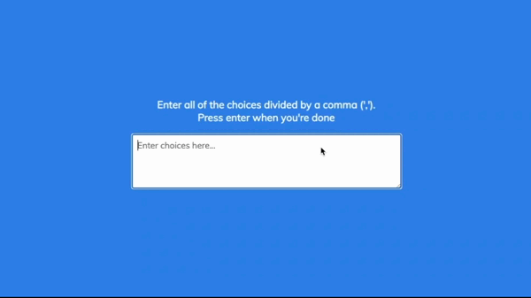

# Random Choice Picker

This project allows users to input their choices into boxes and randomly select one of the choices when the "Enter" button is clicked. The project is implemented using HTML, CSS, and JavaScript.

## Demo

## Getting Started

To get a local copy up and running follow these simple steps.

### Prerequisites

- A web browser (e.g., Chrome, Firefox, Safari)

## Installation

1. Clone the repository:  
   `git clone https://github.com/IqbalAhmadi/random-choice-picker.git`

2. Open the index.html file in your web browser.

## Usage

1. Enter your choices in the boxes.
2. Click the "Enter" button.
3. The application will randomly select one of the choices for you.

## Contributing

Contributions are welcome. If you find any bugs or have any suggestions for improvement, please create an issue or submit a pull request.
